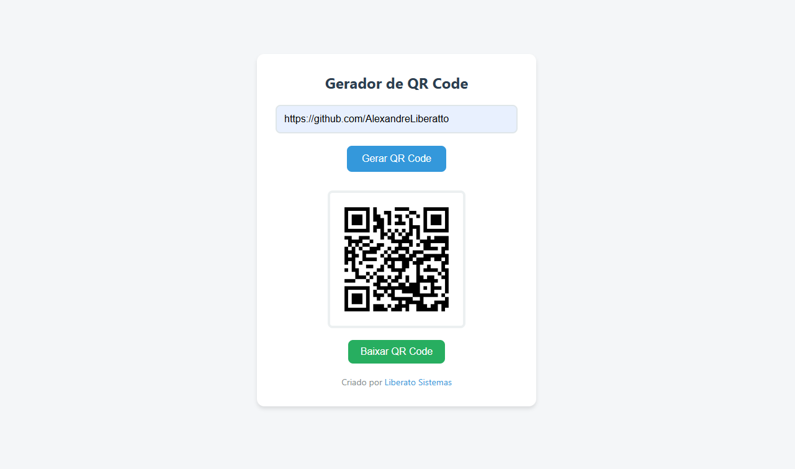
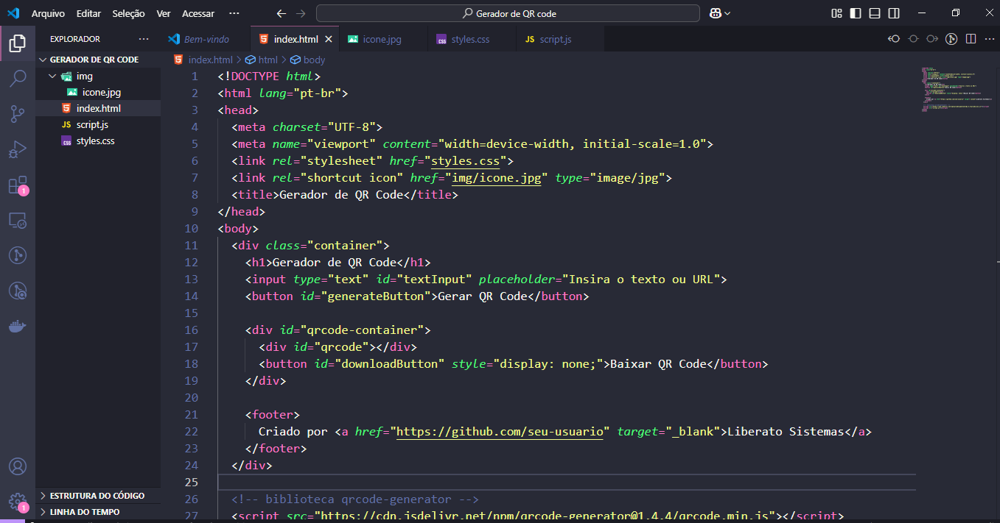

# Gerador de QR Code

 

Um gerador de QR Code simples e funcional desenvolvido em JavaScript. Este projeto permite criar QR Codes a partir de qualquer texto ou URL e baixá-los como imagens PNG.

## Demonstração

### Interface do Projeto


### Estrutura do Código


Você pode testar o gerador de QR Code online [aqui](https://github.com/AlexandreLiberatto/Gerador-QR-Code).

---

## Funcionalidades

- Gere QR Codes a partir de qualquer texto ou URL.
- Baixe o QR Code como uma imagem PNG.
- Interface moderna, responsiva e fácil de usar.

---

## Estrutura do Projeto

```
Gerador-QR-Code/
├── index.html          # Arquivo principal com HTML
├── styles.css          # Arquivo de estilos CSS
├── script.js           # Lógica JavaScript para gerar e baixar QR Codes
├── img/
│   ├── Print1.png      # Imagem da interface do projeto
│   ├── Print2.png      # Imagem da estrutura do código
│   └── icone.jpg       # Ícone do projeto
└── README.md           # Documentação do projeto
```

---

## Como Usar

### 1. Clonando o Repositório

Para usar este projeto localmente, clone o repositório com o seguinte comando:

```bash
git clone https://github.com/AlexandreLiberatto/Gerador-QR-Code.git
```

### 2. Abrindo no Navegador

Após clonar o repositório, abra o arquivo `index.html` no seu navegador:

```bash
cd Gerador-QR-Code
open index.html
```

Ou simplesmente clique duas vezes no arquivo `index.html` na pasta do projeto.

### 3. Gerando um QR Code

1. Insira o texto ou URL desejado no campo de entrada.
2. Clique no botão "Gerar QR Code".
3. O QR Code será exibido abaixo do botão.
4. Clique no botão "Baixar QR Code" para salvar a imagem.

---

## Tecnologias Utilizadas

- **HTML5**: Estrutura básica do projeto.
- **CSS3**: Estilização moderna e responsiva.
- **JavaScript**: Lógica para gerar e baixar QR Codes.
- **qrcode-generator**: Biblioteca leve para geração de QR Codes ([GitHub](https://github.com/kazuhikoarase/qrcode-generator)).

---

## Autor

**Alexandre Liberato**  
Aluno na **UNISENAI**  
Florianópolis - SC  

🔗 [Portfólio](https://portfolio-3-d-olive.vercel.app/)  
💼 [LinkedIn](https://www.linkedin.com/in/alexandre-liberato-32179624b/)  
📧 [E-mail](mailto:alexandreliberatto@gmail.com)  
📱 [WhatsApp](https://api.whatsapp.com/send?phone=+5548991604054)

[](https://api.whatsapp.com/send?phone=+5548991604054)  
[](https://www.linkedin.com/in/alexandre-liberato-32179624b/)  
[](mailto:alexandreliberatto@gmail.com)

---

## Contribuição

Contribuições são bem-vindas! Se você quiser melhorar este projeto, siga os passos abaixo:

1. Faça um fork deste repositório.
2. Crie uma branch para sua feature: `git checkout -b minha-feature`.
3. Faça suas alterações e commit: `git commit -m "Adiciona nova feature"`.
4. Envie suas alterações: `git push origin minha-feature`.
5. Abra um Pull Request no GitHub.

Certifique-se de seguir as boas práticas de código e documentação.

---

## Licença

Este projeto está licenciado sob a [MIT License](LICENSE). Isso significa que você pode usá-lo, modificá-lo e distribuí-lo livremente.

---

### Observações Finais

Se precisar de ajuda ou tiver sugestões, sinta-se à vontade para abrir uma issue no repositório ou entrar em contato diretamente!

